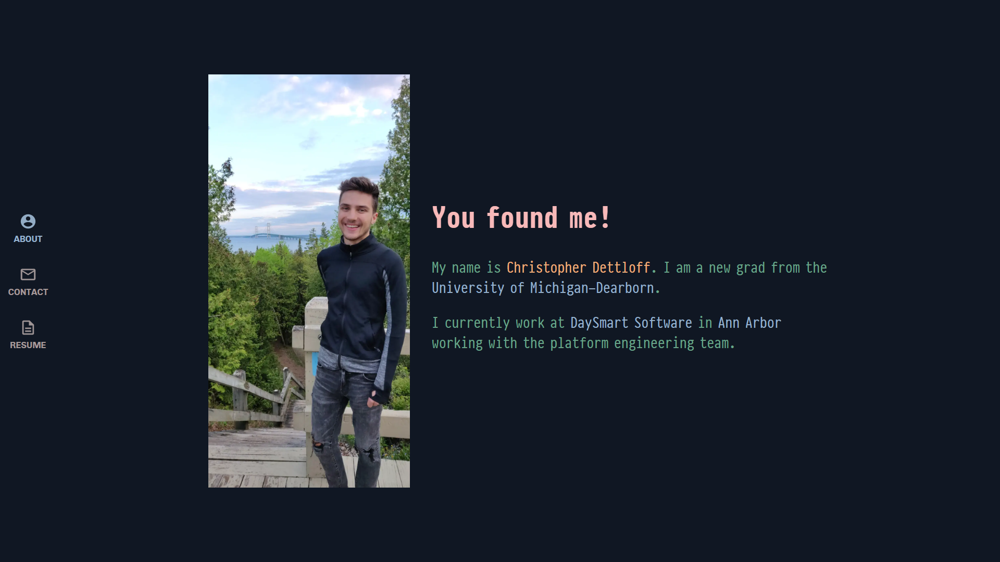

<h1 align="center">
  chrisdettloff.com
</h1>

  The second iteration of <a href="https://www.chrisdettloff.com" target="_blank">chrisdettloff.com</a>

  

## Stack

#### Foundation

Built using the **[GatsbyJS](https://github.com/gatsbyjs/gatsby)** framework.

#### Data
Page content is stored in markdown files and queried with [**GraphQL**](https://graphql.org/).

#### Styling

Styling is done using [**Styled Components**](https://www.styled-components.com).

## Linting & Formatting

The codebase is type-checked using **[TypeScript](https://www.typescriptlang.org/)**, the formatting is done using **[Prettier](https://github.com/prettier/prettier)** and linting is done using **[TSLint](https://palantir.github.io/tslint/)**. Enforced with commit hooks.

## CI/CD

The page is built and deployed by **[Netlify](https://netlify.com)** when changes are push to `master`. 
